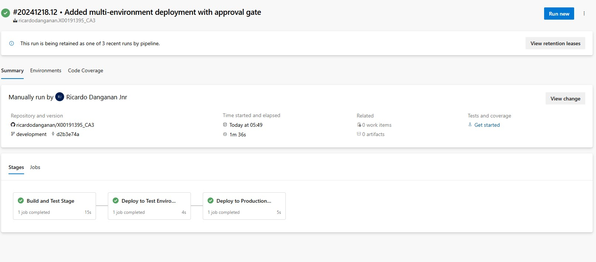

# X00191395_CA3

## GitHub Repository Setup

To meet submission requirements for CA3, the following steps were taken to create and configure the GitHub repository:

### Repository Creation

- A new repository named `X00191395_CA3` was created on GitHub.
- The repository was initialized with a `README.md` file and set to **Private**.

### Adding Collaborator

- The lecturer, Mr. Damian Niezgoda, was added as a collaborator with **Maintain/Admin** privileges.

### Repository Cloning

- The repository was cloned locally to `C:/College - DevOps_Projects/X00191395_CA3`.

#### Screenshots:


## Azure DevOps Project Setup

To meet submission requirements, the Azure DevOps project was created and configured as follows:

### Project Creation

- A new Azure DevOps project named `X00191395_CA3` was created.
- The project visibility was set to **Private**.

### Adding Project Administrator

- The lecturer, Mr. Damian Niezgoda, was added as a Project Administrator.

#### Screenshots:


## Branch Management Strategy

To follow best practices in source control, the following branches were created:

1. **Main Branch**:

   - The production-ready branch that contains stable code.
   - All changes are reviewed and tested before being merged here.

2. **Development Branch**:
   - The working branch where new features and fixes are developed.
   - Changes are tested here before being merged into the main branch.

### Steps to Create the Development Branch

1. Checked out the main branch:

   ```bash
   git checkout main

   ```

2. Created and switched to the development branch:

   ```bash
   git checkout -b development

   ```

3. Pushed the branch to GitHub:
   ```bash
   git push -u origin development
   ```

#### Screenshots:


## **CI/CD Pipeline Implementation**

### **Overview**

The CI/CD pipeline was set up in Azure DevOps to automate the build and testing of the To-Do List application. It performs the following tasks:

1. **Set Up Python 3.x**: Installs the Python environment.
2. **Install Dependencies**: Upgrades `pip` for package management.
3. **Run Unit Tests**: Executes unit tests defined in `test_todo.py`.

---

### **Steps to Create the Pipeline**

1. **Created the Pipeline in Azure DevOps**:

   - Selected **GitHub** as the source.
   - Chose the repository `X00191395_CA3`.

2. **Added the Pipeline Configuration**:

   ```bash
   touch azure-pipelines.yml
   trigger:
   - development
   stages:
   - stage: Build
   displayName: 'Build and Test Stage'
   jobs:
   - job: BuildAndTest
    displayName: 'Install and Run Tests'
    pool:
    vmImage: 'ubuntu-latest'
    steps:
    - task: UsePythonVersion@0
      inputs:
      versionSpec: '3.x'
      displayName: 'Set Up Python 3.x'
    - script: |
      python -m pip install --upgrade pip
      displayName: 'Upgrade Pip'
    - script: |
      python -m unittest test_todo.py
      displayName: 'Run Unit Tests'

   ```

3. **Committed and Pushed the Pipeline to GitHub**:

   ```bash
   git add azure-pipelines.yml
   git commit -m "Added CI/CD pipeline configuration"
   git push origin development

   ```

4. **Ran the Pipeline**:
   - Triggered the pipeline manually from Azure DevOps.
   - Verified the success of each step.

#### Screenshots:


## **Multi-Environment Deployment**

### **Overview**

The pipeline includes three stages:

1. **Build and Test Stage**: Runs unit tests for the application.
2. **Deploy to Test Environment**: Deploys the application to a Test environment.
3. **Deploy to Production Environment**: Deploys to Production with an approval gate.

---

### **Steps to Implement Multi-Environment Deployment**

1. **Updated the Pipeline Configuration**:

   ```yaml
   trigger:
     - development

   stages:
     - stage: Build
       displayName: "Build and Test Stage"
       jobs:
         - job: BuildAndTest
           displayName: "Install and Run Tests"
           pool:
             vmImage: "ubuntu-latest"
           steps:
             - task: UsePythonVersion@0
               inputs:
                 versionSpec: "3.x"
               displayName: "Set Up Python 3.x"

             - script: |
                 python -m pip install --upgrade pip
               displayName: "Upgrade Pip"

             - script: |
                 python -m unittest test_todo.py
               displayName: "Run Unit Tests"

     - stage: DeployToTest
       displayName: "Deploy to Test Environment"
       dependsOn: Build
       condition: succeeded()
       jobs:
         - deployment: TestDeploy
           displayName: "Deploy to Test"
           environment: "Test"
           strategy:
             runOnce:
               deploy:
                 steps:
                   - script: echo "Deploying To-Do List App to Test Environment"
                     displayName: "Deploy Step"

     - stage: DeployToProduction
       displayName: "Deploy to Production Environment"
       dependsOn: DeployToTest
       condition: succeeded()
       jobs:
         - deployment: ProdDeploy
           displayName: "Deploy to Production"
           environment: "Production"
           strategy:
             runOnce:
               deploy:
                 steps:
                   - script: echo "Deploying To-Do List App to Production Environment"
                     displayName: "Deploy Step"
   ```

2. **Committed and Pushed Changes**:

   ```bash
   git add azure-pipelines.yml
   git commit -m "Added multi-environment deployment with approval gate"
   git push origin development

   ```

3. **Committed and Pushed Changes**:

- Manually ran the pipeline in Azure DevOps.
- Monitored each stage.

#### Screenshots:



### **Publishing Build Artifacts**

After the Build and Test Stage, the pipeline publishes artifacts for deployment and reference.

1. **Updated Pipeline**:

   - Added a `PublishBuildArtifacts` step to save build outputs.

2. **Artifact Details**:
   - **Name**: `ToDoApp-Build`
   - **Contents**: Source code and test outputs.

---

### **Screenshots**:

1. **Artifact Published**:
   

# Security Testing Documentation

## Overview

This section documents the **security testing** integration in the Azure DevOps CI/CD pipeline using **npm audit**. The **npm audit** security scan ensures that vulnerabilities in dependencies are identified and reported before deployment to production.

---

## Security Testing Implementation

### Tools Used

- **npm audit**: A built-in tool in Node.js for identifying security vulnerabilities in project dependencies.
- **Azure DevOps**: Used to run the npm audit scan and report results.

---

### Pipeline Integration

The security testing stage was integrated after deploying to the **Test Environment** and before deploying to **Production**.

---

### Pipeline YAML Code

1. **Below is the **updated YAML code** for the simplified security testing using **npm audit\*\*:

```yaml
# Security Testing Stage
- stage: SecurityTesting
  displayName: "Run Security Testing"
  dependsOn: DeployToTest
  condition: succeeded()
  jobs:
    - job: NPMAudit
      displayName: "Run NPM Audit Security Scan"
      pool:
        vmImage: "ubuntu-latest"
      steps:
        # Run npm audit
        - script: |
            npm install
            npm audit --audit-level=low --json > npm-audit-report.txt || echo "npm audit found vulnerabilities"
          displayName: "Run NPM Audit"

        # Publish NPM Audit Report
        - task: PublishBuildArtifacts@1
          inputs:
            PathtoPublish: "npm-audit-report.txt"
            ArtifactName: "NPM-Audit-Report"
          displayName: "Publish NPM Audit Report"
```
### How It Works

1. **Run NPM Audit**:
- Installs project dependencies using npm install.
- Executes npm audit with --audit-level=low to scan for vulnerabilities.
- Outputs the audit report in JSON format and saves it as npm-audit-report.txt.

2. **Publish the Report**:
- The npm audit report is published as a build artifact named NPM-Audit-Report.
- This artifact allows easy review of vulnerabilities.

## Pipeline Results

1. **Successful Execution**:
- The pipeline successfully runs npm audit and generates a vulnerability report.
- The report is published as part of the build artifacts.

2. **Pipeline Summary**:
- The SecurityTesting stage runs after the "Deploy to Test" stage.
- Artifacts such as the npm-audit-report.txt are stored and accessible for review.

## Artifacts and Reports

1. **NPM-Audit-Report**:
- Contains the output from npm audit.
- Stored as a text file (npm-audit-report.txt) in the Azure DevOps pipeline.

### **Screenshots**:
 

 ### **Screenshots**:
 